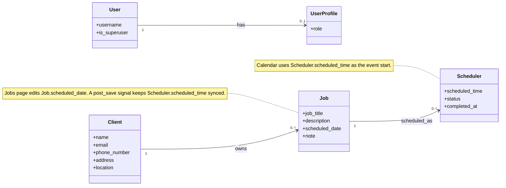
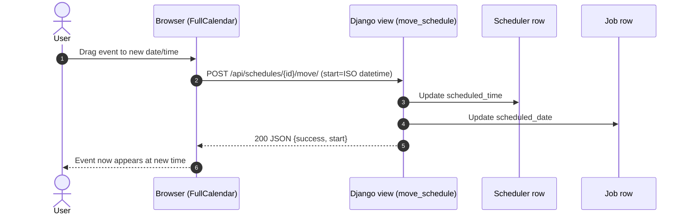

# Paragon Scheduler — UML (Mermaid)

## Domain model (class diagram)



## Web app structure (component diagram)

```mermaid
flowchart LR
  browser[Browser]
  templates["Templates<br/>base.html<br/>home.html<br/>schedule.html<br/>..."]
  urls_project["paragon_scheduler/urls.py<br/>\"/\" includes scheduler.urls"]
  urls_app["scheduler/urls.py"]
  views["scheduler/views.py"]
  models["scheduler/models.py<br/>Client, Job, Scheduler, UserProfile"]
  db[(SQLite db.sqlite3)]

  browser --> templates
  browser --> urls_project --> urls_app --> views --> models --> db

  %% FullCalendar interactions
  browser -. fetch JSON .-> views
  views -. JSON .-> browser

  subgraph Calendar APIs
    api1["GET /api/schedules/<br/>schedules_json"]
    api2["POST /api/schedules/{id}/move/<br/>move_schedule"]
    api3["POST /api/schedules/{id}/toggle/<br/>toggle_schedule_status"]
    api4["POST /api/schedules/{id}/delete/<br/>delete_schedule"]
    api5["POST /api/schedules/{id}/unschedule/<br/>unschedule_job"]
    api6["POST /api/schedules/create/<br/>create_schedule_from_job"]
    api7["GET /api/jobs/<br/>jobs_json"]
    api8["POST /api/jobs/{id}/delete/<br/>delete_job_api"]
    api9["POST /api/jobs/create/<br/>create_job_and_schedule"]
    api10["GET /api/clients/<br/>clients_json"]
  end

  views --- api1
  views --- api2
  views --- api3
  views --- api4
  views --- api5
  views --- api6
  views --- api7
  views --- api8
  views --- api9
  views --- api10
```

## Calendar move flow (sequence diagram)



### Notes
- These diagrams reflect the current codebase structure (Django project `paragon_scheduler` with app `scheduler`).
- Mermaid renders in GitHub and in VS Code with a Mermaid preview extension.
